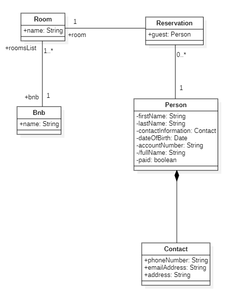
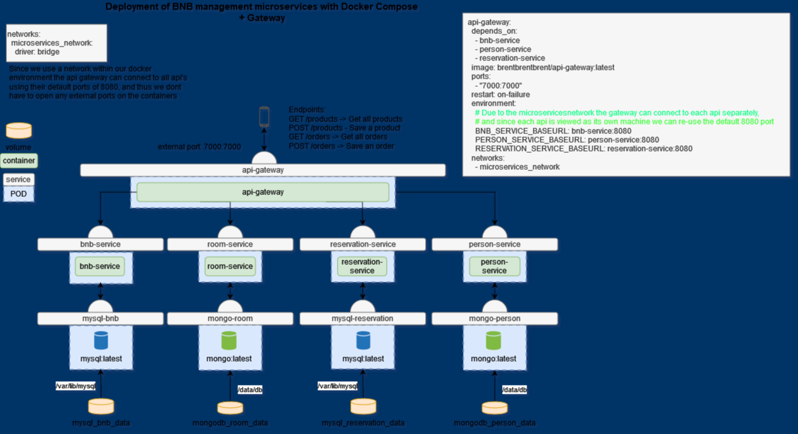

# Enterprise Development Experience Project

## BNBs - Bed & Breakfast Management System

---

### Team Members:

- Brent Simons
- Siebe Michiels

### Description:

This repository contains our school project for the Enterprise Development Experience class. Our project, titled "BNBs - Bed & Breakfast Management System" is designed to demonstrate our understanding of enterprise-level application development using microservices architecture. We have implemented four microservices that collectively form a comprehensive management system for managing multiple Bed & Breakfast establishments. Our inspiration for this project came from the Bed and Breakfast owned by Brent's father.

### Microservices:

| API Name    | Description                                              | Database |
|-------------|----------------------------------------------------------|----------|
| Bnb         | Bed and breakfast establishments                         | MySQL    |
| Room        | Rooms available in a BnB establisment                    | MongoDB  |
| Reservation | Reservations made under a room                           | MySQL    |
| Person      | Customers that are recorded in the system | MongoDB  |

### ERD Model

## API Gateway

### API/Docker compose Diagram

In this diagram you can see an overview of our microservices architecture

### Endpoints:

| Endpoint          | API         | Description                | Authorized | Parameters/Body |
|-------------------|-------------|----------------------------|------------|-----------------|
| /test/reservation | reservation | Tests the reservation API  | No         | /               |
| /auth/test        | bnb         | Securely tests the bnb API | Yes        | /               |

For more info about our endpoints please view the file [endpoint_examples.md](endpoint_examples.md)

### End result screenshots of each endpoint:

(To be added later)

