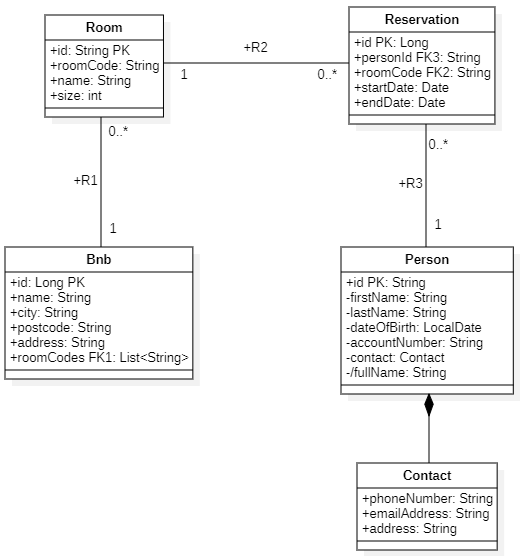

# Enterprise Development Experience Project

## BNBs - Bed & Breakfast Management System

---

### Team Members:

- Brent Simons
- Siebe Michiels

### Description:

This repository contains our school project for the Enterprise Development Experience class. Our project, titled "BNBs - Bed & Breakfast Management System" is designed to demonstrate our understanding of enterprise-level application development using microservices architecture. We have implemented four microservices that collectively form a comprehensive management system for managing multiple Bed & Breakfast establishments. Our inspiration for this project came from the Bed and Breakfast owned by Brent's father.

### Microservices:

| API Name    | Description                               | Database |
|-------------|-------------------------------------------|----------|
| Bnb         | Bed and breakfast establishments          | MySQL    |
| Room        | Rooms available in a BnB establisment     | MongoDB  |
| Reservation | Reservations made under a room            | MySQL    |
| Person      | Customers that are recorded in the system | MongoDB  |

## Local Hosting

To run the project locally, follow these steps:

```bash
git clone https://github.com/BrentSimons/Project-EDE-BNB
cd Project-EDE-BNB
```

Build and Run Docker Containers:

```bash
docker-compose up -d
```

Access the Angular app at http://localhost:4200.

Angular Development Server:
Navigate to the bnb-frontend folder:

```bash
cd bnb-frontend
```

Start the Angular development server:

```bash
ng serve
```

### ERD Model



## API Gateway

### API/Docker compose Diagram


In this diagram you can see an overview of our microservices architecture

### Endpoints:

| HTTP <br> method | Endpoint                                  |   Service   | Description                                                                                      |            Authorized            | Parameters/Body                      |
|------------------|-------------------------------------------|:-----------:|--------------------------------------------------------------------------------------------------|:--------------------------------:|--------------------------------------|
| GET              | /public/bnb?name=                         |     Bnb     | Retrieve all bnb's that have the given parameter in their name                                   | <font color="#ff1a1a">No</font>  | `name`                               |
| GET              | /public/rooms/available?id=               |     Bnb     | Retrieve all rooms from given `bnbId` depending on the given filters (see endpoints_examples.md) | <font color="#ff1a1a">No</font>  | `bnbId` <br> `AvailableRoomRequest`  |
| GET              | /bnb/all?name=                            |     Bnb     | Same as /public/bnb?name=                                                                        | <font color="#47d147">Yes</font> | `name`                               |
| GET              | /bnb/{id}                                 |     Bnb     | Retrieve one  bnb with given `id`                                                                | <font color="#47d147">Yes</font> |                                      |
| POST             | /bnb                                      |     Bnb     | Create a new bnb                                                                                 | <font color="#47d147">Yes</font> | `BnbRequest`                         |
| PUT              | /bnb/{id}                                 |     Bnb     | Update the bnb with given `id`                                                                   | <font color="#47d147">Yes</font> | `BnbRequest`                         |
| DELETE           | /bnb/{id}                                 |     Bnb     | Delete the bnb with given `id`                                                                   | <font color="#47d147">Yes</font> | `BnbRequest`                         |
| PUT              | /bnb/addRoom?bnbId= &roomCode=            |     Bnb     | Add a new room with `roomCode` to bnb with given `bnbId`                                         | <font color="#47d147">Yes</font> | `bnbId` <br> `roomCode`              |
| PUT              | /bnb/removeRoom?bnbId= &roomCode=         |     Bnb     | Remove the room with `roomCode` from bnb with given `bnbId`                                      | <font color="#47d147">Yes</font> | `bnbId` <br> `roomCode`              |
| GET              | /public/room/available?roomCode= &months= |    Room     | Retrieve all periods during which a given room is available                                      | <font color="#ff1a1a">No</font>  | `roomCode` <br> `months` (default=1) |
| GET              | /room/all                                 |    Room     | Retrieve all rooms                                                                               | <font color="#47d147">Yes</font> |                                      |
| GET              | /room/{id}                                |    Room     | Retrieve one room with given `id`                                                                | <font color="#47d147">Yes</font> |                                      |
| POST             | /room                                     |    Room     | Create a new room, also add the room to the bnb with `bnbId` given in the request body           | <font color="#47d147">Yes</font> | `RoomWithBnbRequest`                 |
| PUT              | /room/{id}                                |    Room     | Update the room with given `id`                                                                  | <font color="#47d147">Yes</font> | `RoomRequest`                        |
| DELETE           | /room/{id}?bnbId=                         |    Room     | Delete the room with given `id`, also remove it from given `bnbId`                               | <font color="#47d147">Yes</font> | `bnbId`                              |
| GET              | /reservation/all                          | Reservation | Retrieve all reservations                                                                        | <font color="#47d147">Yes</font> |                                      |
| GET              | /reservation/{id}                         | Reservation | Retrieve one reservation with given `id`                                                         | <font color="#47d147">Yes</font> |                                      |
| POST             | /reservation                              | Reservation | Create a new reservation                                                                         | <font color="#47d147">Yes</font> | `ReservationRequest`                 |
| PUT              | /reservation/{id}                         | Reservation | Update the reservation with given `id`                                                           | <font color="#47d147">Yes</font> | `ReservationRequest`                 |
| DELETE           | /reservation/{id}                         | Reservation | Delete the reservation with given `id`                                                           | <font color="#47d147">Yes</font> |                                      |
| GET              | /person/all                               |   Person    | Retrieve all persons                                                                             | <font color="#47d147">Yes</font> |                                      |
| GET              | /person/{id}                              |   Person    | Retrieve one person with given `id`                                                              | <font color="#47d147">Yes</font> |                                      |
| POST             | /person                                   |   Person    | Create a new person                                                                              | <font color="#47d147">Yes</font> | `PersonRequest`                      |
| PUT              | /person/{id}                              |   Person    | Update the person with given `id`                                                                | <font color="#47d147">Yes</font> | `PersonRequest`                      |
| DELETE           | /person/{id}                              |   Person    | Delete the person with given `id`                                                                | <font color="#47d147">Yes</font> |                                      |


For more info about our endpoints please view the file [endpoint_examples.md](endpoint_examples.md)


