In this file you will be able to see some examples for all our endpoints, at the bottom of each endpoint there will also be a screenshot of a complete request made in Postman.

# Public Endpoints


### 1. GET /public/bnb?name=Hugo

This is a public endpoint that can be used to get an overview of all our bnbs. 

The optional `name` parameter can be used to filter through the bnbs in our system.

If multiple bnbs contain the text of the parameter within their name, they will all be returned.

Example results:

When no `name` is given, all bnb's are returned:

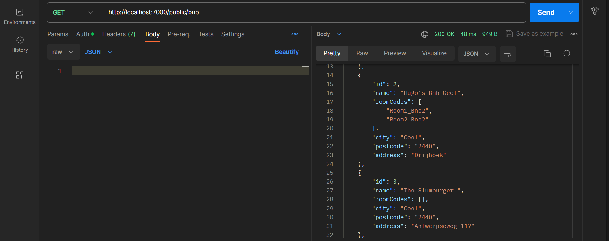

When a `name` value is given, only the bnb's whose names contain the given value are returned:

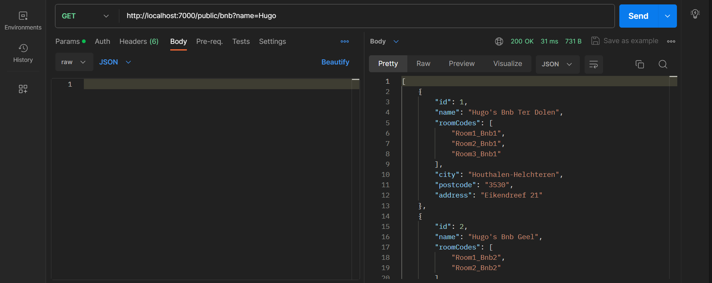

### 2. GET /public/rooms/available?id=\<bnbId\>

This is a public endpoint that can be used by the client to check if (and which) rooms from a certain bnb are available.

Required body:

```json
{
    "roomCodes": [],
    "startDate": "2024-05-7",
    "endDate": "2024-05-11",
    "size": 3
}
```

The list of `roomCodes` is left empty, this list will automatically be filled with the roomCodes that belong to the given `bnbId` in the url.

The `startDate` and `endDate` are used to check if the rooms are available during a certain period. This way the client can choose when they want to go on a vacation to the given bnb and thus they can easily check if and which rooms are available during that period. The rooms that are not free during the entirety of this period will still be returned but with the value `available: false`.

The `size` parameter can be used to filter rooms which are too small for your group, note that when a room is too small it will not be returned. This way the client can indicate how many people will need to stay in the bnb, only rooms that are big enough (also bigger) will be returned.

Example result:

This is a visualisation of the reservations for the bnb with `id=1`:


Since all rooms from bnb with `id=1` have a `size` greater than or equal to 2, all rooms will be returned. 
The room with `roomCode=Room1_Bnb1` already has a reservation from March 10th until March 15th and therefore it will be returned with `"available": false`:

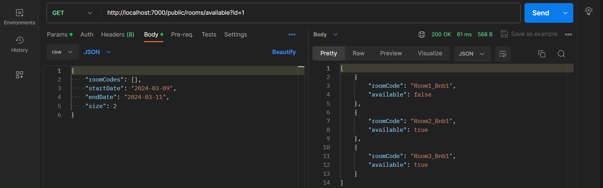

If the `size` value in the request body is changed to 3, `Room3_Bnb1` will not be returned (since it has a size of 2 so it is too small):

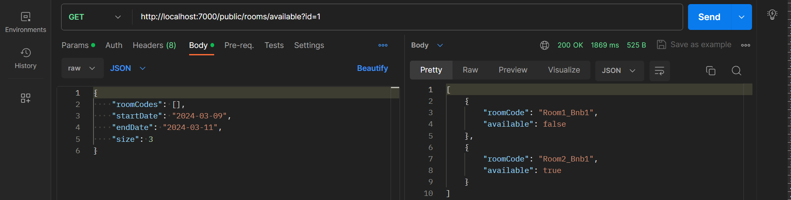

If we test another period inside the request body, we see that `Room1_Bnb1` is available from March 16th until March 18th while `Room2_Bnb1` is unavailable:


<details>
  <summary style="color: #2581e8; text-decoration: underline; font-size: 24px">See which endpoints are used behind the scenes</summary>
  
  ### 1. GET /public/rooms/available?id=\<bnbId\>
  This method retrieves all `roomCodes` form the bnb with given `bnbId`, then it passes an `AvailableRoomRequest` object as the request body to the next endpoint.

  ### 2. POST localhost:8085/api/room/availableRooms
  This method filters all `roomCodes` from the request body based on `size`, only rooms that are big enough will be passed on to the next endpoint.
  
  As we saw in one of the previous examples, the bnb with `id=1` has 3 rooms: `Room1_Bnb1`, `Room2_Bnb1`, `Room3_Bnb1` with `sizes` 5, 3 and 2  respectively. This means `Room3_Bnb1` is too small and therefore will not be passed on to the next endpoint:
  
  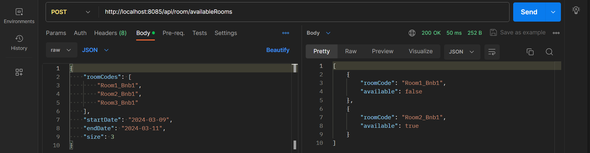

  ### 3. POST localhost:8090/api/reservation/availableRooms
  This method checks all `roomCodes` in the request body and returns whether or not they are available during the given time period. This info will be converted to a list of `AvailableRoomResponse` objects.

  As you can see `Room3_Bnb1` is not present in the request body, this means that it was not big enough.

  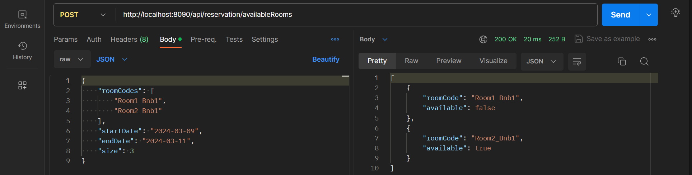

</details>

### <br>3. GET /public/room/available?roomCode=<Room2_Bnb1>&months=<3>

This is a public endpoint that can be used to check whether a specific room is available within the next month(s).

The `roomCode` parameter is required and specifies which room you want to check availability for.

The `months` parameter is optional, it has default value of 1 but can be changed to any integer. 

Example results:

When no value is given for `months`, the value 1 will be used. This means that it will check on what days the given room is available.

Here you can see that `Room2_Bnb1` has one reservation from January 20th until January 22nd:

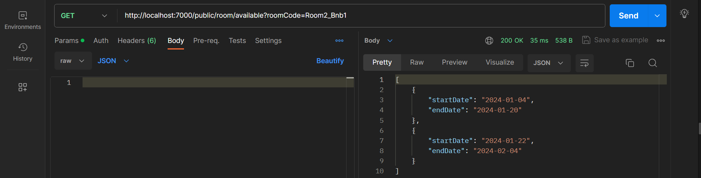

In the following example the application will check for the next 3 months. Here you can see that there are multiple reservations for `Room2_Bnb1` planned during the next 3 months:

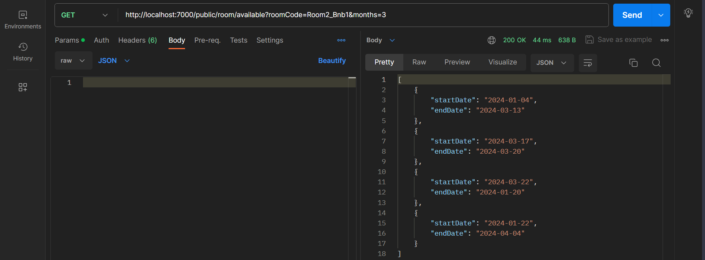

As you can see in this result the room is available for 4 seperate periods. This means that there are 3 reservations planned for this room (the gaps between the available periods that are returned).


# <br>Authenticated Endpoints


## Bnb

### 1. GET /bnb/all
Returns all bnbs, this  method also has the option to add `?name=<name>` to the url to filter on name. Take a look at /public/bnb at the top of this file for more info.

Example request:

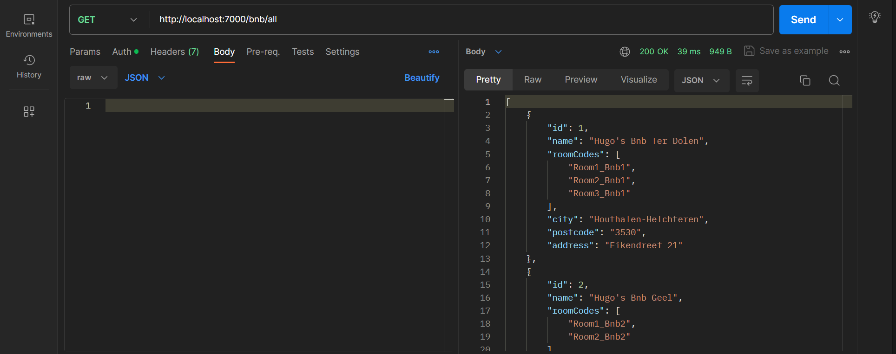

### 2. GET /bnb/\<id\>
Returns a single bnb that has the given `id`.

Example request:

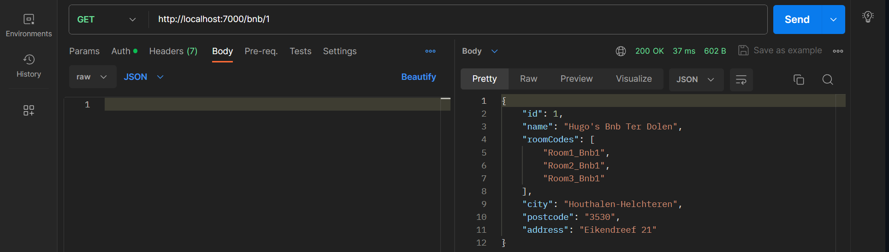

### 3. POST /bnb
Create a new bnb.

Required body:
```json
{
    "name": "The Slumburger ",
    "roomCodes": [
        "Room1",
        "Room2",
        "Room3"
    ],
    "city": "Geel",
    "postcode": "2440",
    "address": "Antwerpseweg 117"
}
```

Example request:

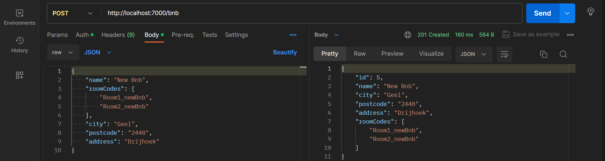

### 4. PUT /bnb/\<id\>
You add the `id` of the bnb you want to edit to the url.

Besides an `id` in the url, this request also needs a body with data for the updated bnb, all fields that are not explicitly assigned a value will be ignored. In the following request body example only `name` will be updated:
```json
{
    "name": "Only name will be changed",
    "city": null,
    "postcode": null,
    "address": null
}
```

Example request:

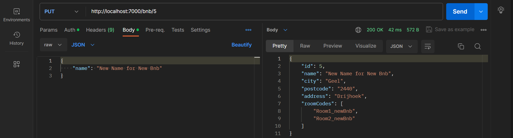

### 5. DELETE /bnb/\<id\>
Delete the bnb that corresponds to the given `id`.

Example request:

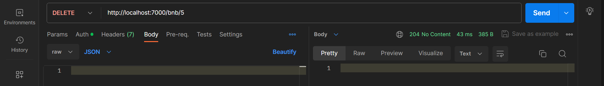


## Room

### 1. GET /room/all
Returns all rooms.

Example request:

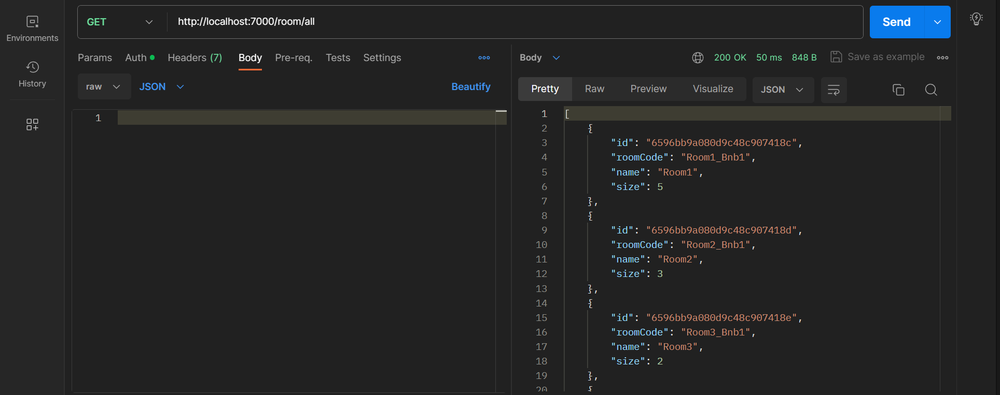

### 2. GET /room/\<id\>
Returns a single room that has the given `id`.

Example request:

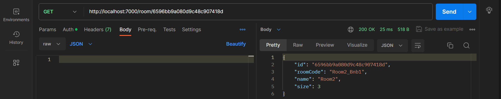

### 3. POST /room
Create a new room.

Required body:
```json
{
    "roomRequest": {
        "roomCode": "Room1_Bnb1",
        "name": "Room 1",
        "size": 3
    },
    "bnbId": 2
}
```

Example request:

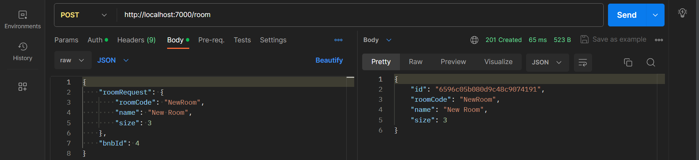

This request also adds the `roomCode` of the newly created room to the bnb with given `bnbId`. Here you see how it happend when previous request was executed:

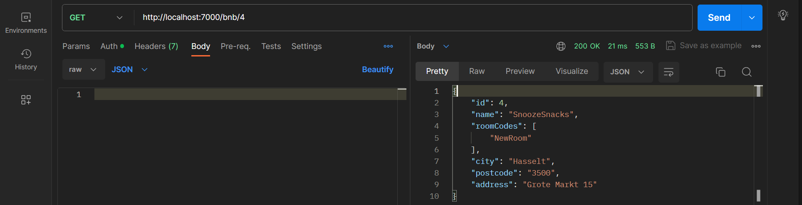

### 4. PUT /room/\<id\>
You have to add the `id` of the room you want to edit to the url.

Besides an `id` in the url, this request also needs a body with data for the updated room, all fields that are not explicitly assigned a value will be ignored. In the following example `name` and `size` will be updated:
```json
{
    "roomCode": null,
    "name": "Dubbele kamer",
    "size": 6
}
```

Example request:

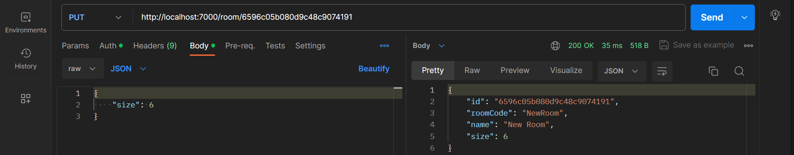

### 5. DELETE /room/\<id\>?bnbId=\<bnbId\>
Delete the room that corresponds to the given `id`, also remove its `roomCode` from the bnb with given `bnbId`.

Example request:

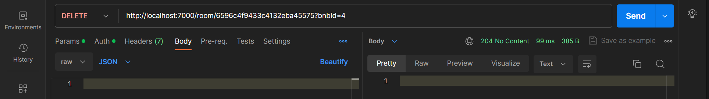

Just like with our POST request, this request automatically removes the `roomCode` of the deleted room in the bnb with given `bnbId`. Here is how it happend when previous request was executed:

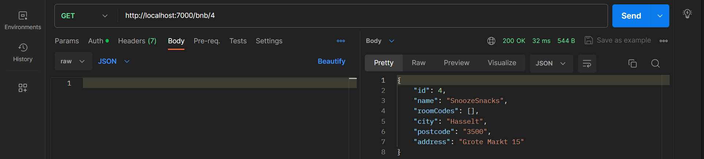


## Reservation

### 1. GET /reservation/all
Returns all reservations.

Example request:

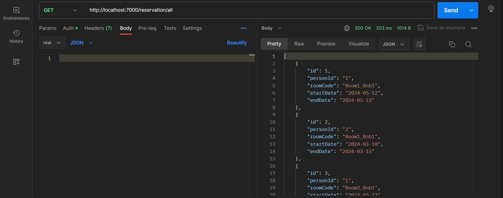

### 2. GET /reservation/\<id\>
Returns a single reservation that has the given `id`.

Example request:

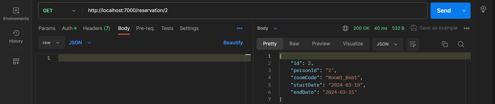

### 3. POST /reservation
Create a new reservation.

Required body:
```json
{
    "personId": "2",
    "roomCode": "Room2_Bnb2",
    "startDate": "2024-03-15",
    "endDate": "2024-03-17"
}
```

Example request:

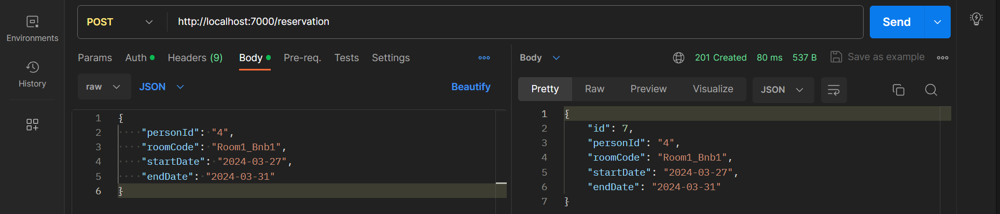

### 4. PUT /reservation/\<id\>
You have to add the `id` of the reservation you want to edit to the url.

Besides an `id` in the url, this request also needs a body with data for the updated reservation, all fields that are not explicitly assigned a value will be ignored. In the following example only `endDate` will be updated:
```json
{
    "personId": null,
    "roomCode": null,
    "startDate": null,
    "endDate": "2024-03-17"
}
```

Example request:

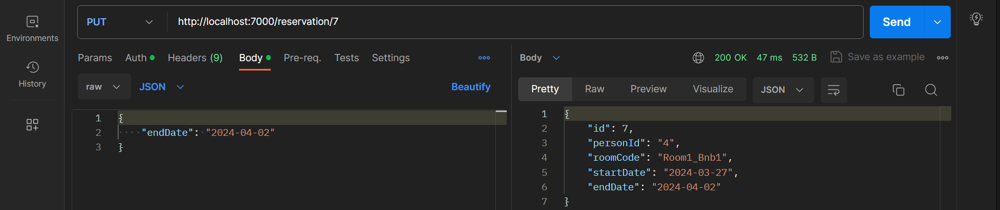

### 5. DELETE /reservation/\<id\>
Delete the reservation that corresponds to the given `id`.

Example request:

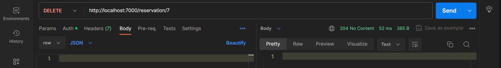


## Person

### 1. GET /person/all
Returns all persons.

Example request:


### 2. GET /person/\<id\>
Returns a single person that has the given `id`.

Example request:

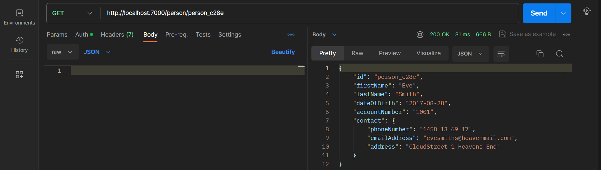

### 3. POST /person
Create a new person.

Required body:
```json
{
    "firstName": "Adam",
    "lastName": "Johns",
    "dateOfBirth": "2013-09-25",
    "accountNumber": "1000",
    "contact": {
        "phoneNumber": "0589 69 14 32",
        "emailAddress": "adamjohns23@heavenmail.com",
        "address": "AngelStreet 26 Godtown"
    }
}
```

Example request:

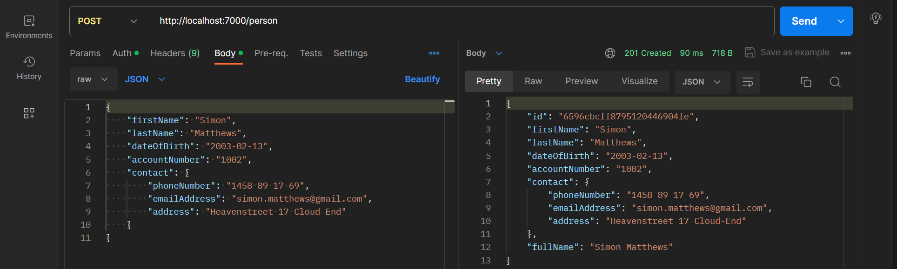

### 4. PUT /person/\<id\>
You have to add the `id` of the person you want to edit to the url.

Besides an `id` in the url, this request also needs a body with data for the updated person, all fields that are not explicitly assigned a value will be ignored. In the following example `lastName` and `phoneNumber` will be updated:
```json
{
    "firstName": null,
    "lastName": "Burrows",
    "dateOfBirth": null,
    "accountNumber": null,
    "contact": {
        "phoneNumber": "0589 69 14 90",
        "emailAddress": null,
        "address": null
    }
}
```

Example request:

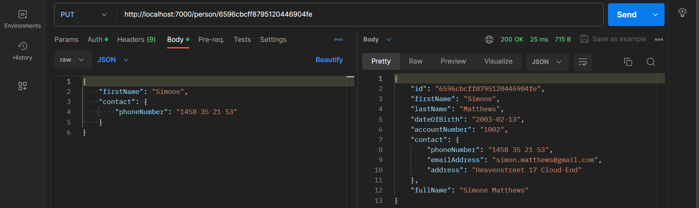

### 5. DELETE /person/\<id\>
Delete the person that corresponds to the given `id`.

Example request:

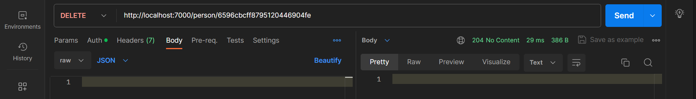